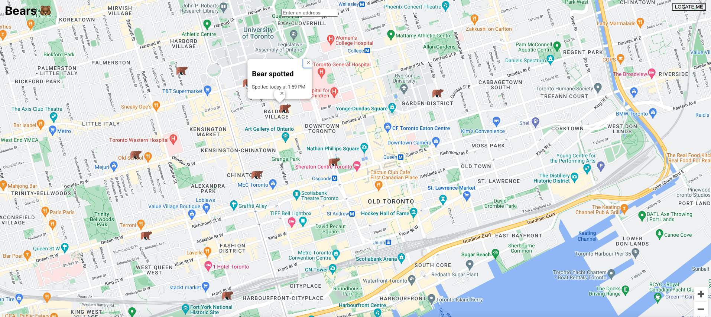

# Getting Started with Create React App

## The below app is my first attempt using google location based APIs.

The project uses

- Google Maps API
- Google Places API
- Geocoding API

It always makes use of react hooks including

- UseCallBack
- UseRef

It serverd as an introduction to the google location based APIs. I will use knowledge from this project to create a localized geosearch app for finding bars and cafe between two nodes.
